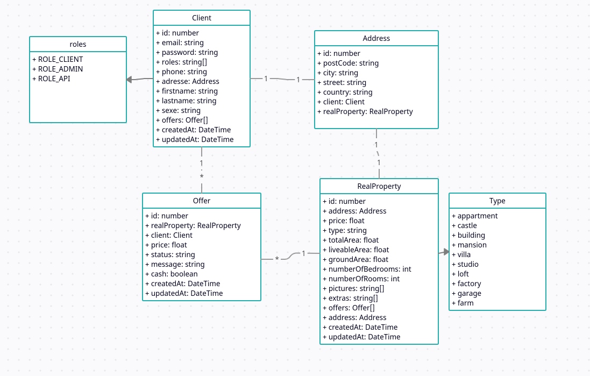

# Formation Symfony 6 - Projet PrestigImmo

L'objectif de ce projet et de créer un site ainsi qu'une api pour vendre des bien immobilier de prestige.

## Les supports

Voici le schèma de nos entités :

Voici le lien vers les maquettes :

[Lien figma](https://www.figma.com/file/zIfLkXWzlZ2JGbld7rBDTe/PrestigImmo?node-id=0%3A1&t=F2nzh0xfhRIpv4GV-1)

> Important : Nous allons uniquement réaliser une intégration pour les mobiles

## Ordre de dévelopement d'une fonctionnalité

1. Le Model / Le DTO
2. Les fixtures
3. Le repository (Query Builder)
4. Le/Les formulaires
5. Le controller
6. La vue (twig)

## Les étapes du projet

1. [Mettre en place la sécurité](./assets/steps/security.md)
2. [Mettre en place la page d'accueil](./assets/steps/home.md)
3. [Mettre en place la page de recherche](./assets/steps/search.md)
4. [Mettre en place la page de profil](./assets/steps/profile.md)
5. [Faire une offre](./assets/steps/order.md)
6. [Administrer les offres](./assets/steps/admin-offer.md)
7. [Terminer une offre](./assets/steps/end-offer.md)

## Les chapitres du cours

1. [Installation (sans docker)](./assets/cours/installation.md)
2. [Installation (avec docker)](./assets/cours/installation-docker.md)
3. [Les Controller & Les Routes](./assets/cours/controller-et-routes.md)
4. [Le Model (Doctrine)](./assets/cours/doctrine.md)
5. [La Vue (Twig)](./assets/cours/view.md)
6. [Le request & les formulaires](./assets/cours/request-form.md)
7. [Les formulaires](./assets/cours/form.md)
8. [Mettre en ligne son application avec Heroku](./assets/cours/online.md)
9. [Les relations avec Doctrine](./assets/cours/relations.md)
10. [Les fixtures avec Alice](./assets/cours/fixtures.md)
11. [Le QueryBuilder](./assets/cours/query-builder.md)
12. [Les formulaires de « recherche »](./assets/cours/search-form.md)
13. [La sécurité (authentification et autorisation)](./assets/cours/security.md)
14. [Les API Rest](./assets/cours/api-rest.md)
15. [Les API Rest avec Symfony](./assets/cours/sf-api-rest.md)
16. [Documenté son API Rest](./assets/cours/api-doc.md)
17. [Les CORS et les API Rest](./assets/cours/cors.md)
18. [La validation](./assets/cours/validation.md)
19. [Les Services et le Container](./assets/cours/services.md)
