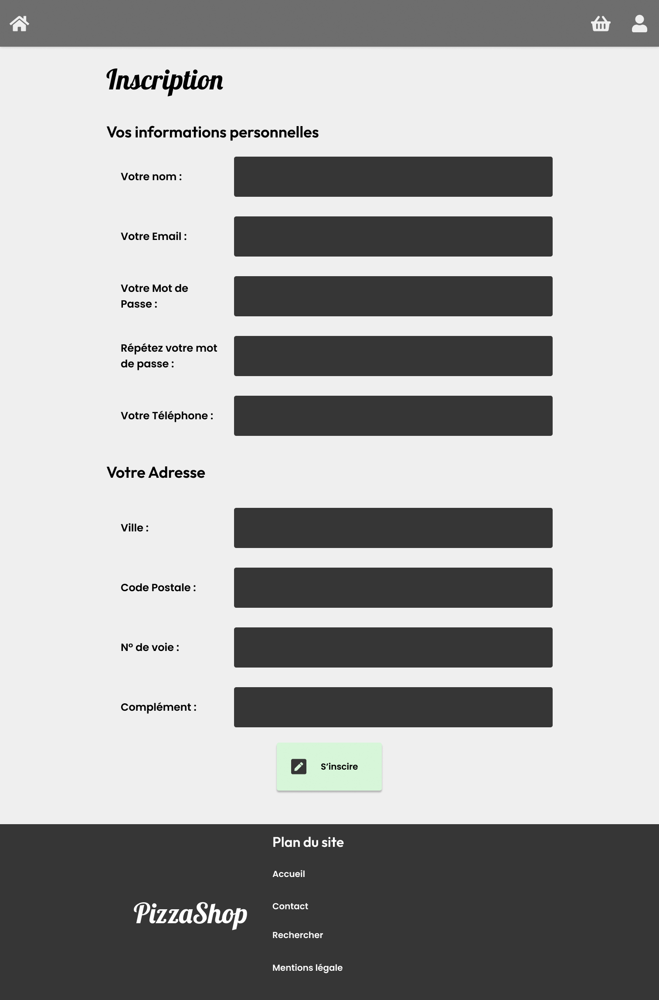

# PHP Projet Pizza Shop

L'objéctif de ce projet est de créer une application
de pizzeria en utilisant PHP :).

## Les documents

Vous retrouverez le design et le cahier des charges sur [figma](https://www.figma.com/file/UTthEDYvWiqKHjANXyYK6O/PizzaShop?node-id=0%3A1).

Vous pouvez aussi utiliser les librairies CSS suivantes :

-   [bootstrap](https://getbootstrap.com/)
-   [fontawesome](https://fontawesome.com/)

## Organisation du projet

Vous retrouverey dans ce projet 2 répertoires :

-   **public** : Ce répertoire contient nos page PHP, mais aussi le css, les images etc ...
-   **src** : Ce répertoire contient le code backend PHP de l'application

## Installation du projet

1. [Télécharger le code du projet](https://github.com/Djeg/formation-symfony/archive/refs/heads/session-php-projet/27.06.22-01.07.22.zip)
2. Extraire le code dans le répertoire htdocs ou www de MAMP
3. Ouvrir le répertoire avec VScode
4. Dans un terminal (celui de VSCode) lancer la commande : `composer install`
5. Configurer la base de données dans le fichier [InscriptionController](./src/Controller/InscriptionController.php#L74)
6. [Insérer la base de données dans phpmyadmin](./sql/pizza-shop-php.sql)

Vous pouvez afficher la page de votre choix en vous rendant via votre navigateur dans la répertoire
public suivie du nom de la page.

## Les étapes :

### 1. L'inscription

Vous pouvez commencer l'application par la page d'inscription :

1. Créer une page php `inscription.php`
2. Afficher le formulaire d'inscription
3. En utilisant les données POST et MySQL, enregistrer une nouvelle
   utilisateur dans la base de données. Attention les champs doivent être validé !
