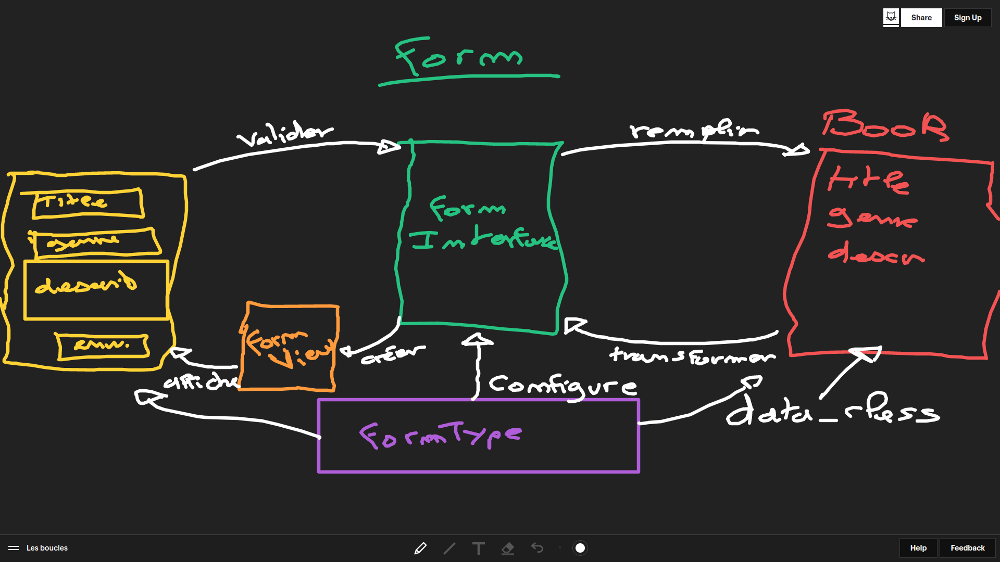
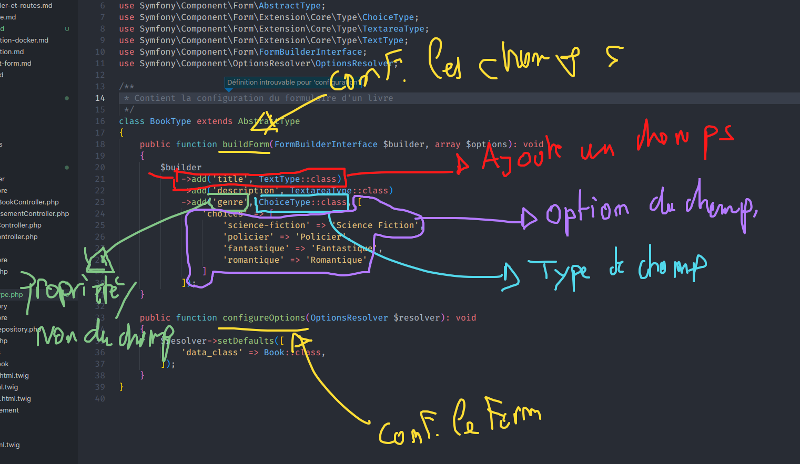
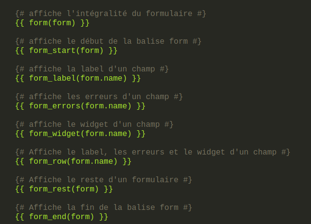

# Les Formulaires

Les formulaire sont la partie la plus centrale d'une application symfony. C'est la partie qui s'occupe des **données**.

## Schèma du fonctionnement



## Première étape : Créer le « FormType »

Le FormType c'est le « cerveau » du formulaire, c'est lui qui s'occupe de tout configurer. En programmation orientée objet, on appel cette architecture : La Facade.

Pour créer un « FormType », il faut tout d'abord possèder une « data_class ». C'est l'objet php qui contient les données du formulaire.

Pour générer un formulaire, il faut utiliser la commande :

```bash
# Si vous n'utiliser pas docker
symfony console make:form book
# Si vous utilisez docker
bin/sf console ma:fo book
```

> **NOTE**
> Il faudra spécifier l'entity ou la class servant de « data_class ».

### Anatomie d'un « FormType »

Un fois le « FormType », une class est disponible dans `src/Form` permettant de configurer votre formulaire :



> **Quelques liens utiles**
> Vous retrouverez toutes la liste des champs de symfony : [ici](https://symfony.com/doc/current/reference/forms/types.html)

## Deuxième étape : Utiliser un formulaire dans un controller !

Tout d'abord, pour créer un « FormInterface ». Il faut utilise la méthode `buildForm` de notre controller :

```php
// Création d'un formulaire de livre
$form = $this->createForm(BookType::class);
```

Pour remplir un formulaire avec les données de l'utilisteur, il faut utiliser la méthode `handleRequest` de notre « FormInterface » :

```php
// On remplie le formulaire
$form->handleRequest($request);
```

Pour valider un formulaire, il faut utiliser 2 méthode, dans l'ordre : `isSubmitted` et `isValid` :

```php
// On test si notre formulaire est valide
if ($form->isSubmitted() && $form->isValid()) {
  // Si je rentre dans cette condition, toutes les données sont valide !
}
```

Pour récupérer les données d'un formulaire (la data_class remplie !!!!) :

```php
// Récupére la « data_class » remplie
$form->getData();
```

Pour envoyer notre formulaire à « Twig » (à un fichier HTML), il faut obligatoirement créer l'objet « FormView » :

```php
// On affiche un template twig
return $this->render('controller/method.html.twig', [
  // On envoie le « FormView » à twig !
  'bookForm' => $form->createView(),
]);
```

## Dernière partie : Afficher un formulaire dans un template twig

Pour afficher le formulaire `bookForm` plus haut dans un fichier twig :

```twig
{{ form(bookForm) }}
```

## Personaliser l'affichage de votre formulaire

Twig met à disposition des fonction permettant de personnaliser l'affichage d'un formulaire :


