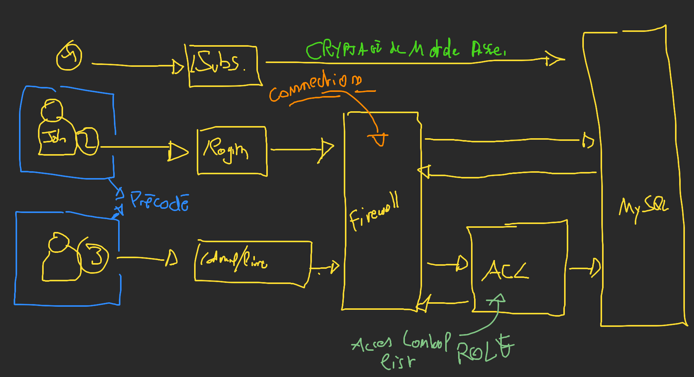

# Securité (Authentification, Authorization)

Un peu de théorie, voici le fonctionnement théorique :



## L'inscription (ou la création d'utilisateur ou un credential)

Pour mettre en place une inscription il nous faut une entité (par exemple l'entité « User »). Afin de générer et de connécter au firewall de symfony, il éxiste une commande nous permettant de faire toutes ces étapes pour nous :

```bash
# sans docker
symfony console make:user <NomEntity>
# avec docker
bin/sf console ma:us <NomEntity>
```

> N'hésitez pas à rajouter des champs si nescessaire avec la commande : `symfony console make:entity <NomEntity>`.

La prochaine étape est de créer un formulaire d'inscription :

```bash
# sans docker
symfony console make:form <NomDuFormulaire>
# avec docker
bin/sf console ma:fo <NomDuFormulaire>
```

Ensuite il nous faut un controller avec un route pour pouvoir s'inscrire :

```php
/**
 * Page d'inscription pour un nouveau compte
 */
#[Route('/inscription', name: 'app_account_create', methods: ['GET', 'POST'])]
public function create(Request $request, AccountRepository $repository, UserPasswordHasherInterface $hasher): Response
{
    // Création de formulaire
    $form = $this->createForm(RegistrationType::class);

    // Remplissage du formulaire
    $form->handleRequest($request);

    // On test si le formulaire est valide
    if ($form->isSubmitted() && $form->isValid()) {
        $account = $form->getData();

        // Crytage du mot de passe en utilisant le UserPasswordHasherInterface :
        $account->setPassword($hasher->hashPassword(
            $account,
            $account->getPassword(),
        ));

        // On enregistre le nouveau compte dans la base de données
        $repository->save($account, true);

        // On redirige vers la page d'accueil
        // @TODO rediriger vers une page de bienvenue
        return $this->redirectToRoute('app_home_home');
    }

    // on affiche la page d'inscription
    return $this->render('account/create.html.twig', [
        'form' => $form->createView(),
    ]);
}
```

N'oubliez pas de faire la Vue ! :)

## Insérer des user (des account) en utilisant les fixtures

Pour insérer un user, ou un account il faut crypter le mot de passe, pour cela il existe une commande Symfony le faisant pour vous :

```bash
# sans docker
symfony console security:hash-password
# avec docker
bin/sf console se:ha
```

Vous pouvez ensuite récupérer le mot de passe crypté et l'insérer dans vos fixtures.

> **ATTENTION** les "$" doivent être échappé !!

```yaml
# password: test
password: \$2y\$13\$9vew0iWK9C0TGcXRMthjj.q4UNqGukfN26AI0jgPLxrKPFO/asfOC
```

## Connécter un utilisateur (account)

Maintenant que nous avons un système d'inscription fonctionnel, nous pouvons demander à symfony de générer 90% de l'authentification :

```bash
# sans docker
symfony console make:auth
# avec docker
bin/sf console make:auth
```

Une fois cette étape passé, vous n'avez plus qu'a personnaliser :

1. La route de redirection dans votre class « Authenticator »
2. Le controller
3. La vue

## Authorization

Afin de pouvoir authorize ou non certains utilisateurs sur certaines pages de notre site internet, symfony à mis en place un système de rôle. Il sont initialement au nombres de 2 :

- **`ROLE_USER`** (celui par défault) : Celui qui peut utiliser l'application
- **`ROLE_ADMIN`** : Celui qui peut utiliser l'application et aussi l'administrer

### Ajouter des rôles

Pour changer le role d'un utilisateur, rien de plus simple :

- Dans les fixtures : Vous pouvez attacher des roles très simplements :

```yaml
roles: ["ROLE_ADMIN"]
```

- En PHP : Il suffit de récuperer l'entité qui s'authentifie (« Account ») :

```php
$entity->setRoles(['ROLE_ADMIN']);
```

### Sécuriser des controller

En utilisant un attribut `IsGranted`, nous pouvons décider qu'un controller n'est accessible que pour certain role :

```php
/**
 * Créer un nouvel utilisateur
 */
#[IsGranted('ROLE_ADMIN')]
#[Route('/admin/utilisateurs/nouveau', name: 'app_adminUser_create', methods: ['GET', 'POST'])]
public function create(Request $request, UserRepository $repository): Response
{
  // code de création d'un user ...
}
```

> Vous pouvez aussi utiliser ce même attribut directement sur la class

### Utiliser les rôles dans la vue

Premièrement, dans un fichier twig, nous pouvons acccéder à l'utilisateur connécté (notre account) grâce à une globale :

```twig
{{ app.user.email }}
```

> Attention, si aucun utilisateur n'est connécté, la variable est null !

```twig

  <p>Vouc êtes connécté</p>

  <p>Vous n'êtes connécté</p>

```

Il est aussi possible de tester le role d'un utilisateur en utilisant la fonction twig `is_granted` :

```twig

  <p>Vous êtes admin</p>

  </p>Vous n'êtes pas admin</p>

```

### Récupérer l'utilisateur (Account) connécté dans un Controller

Pour récupérer l'account (le user) connécté depuis un controller :

```php
// On test si on est connécté
if ($this->getUser()) {
  // On récupére l'account :
  $account = $this->getUser();
}
```
