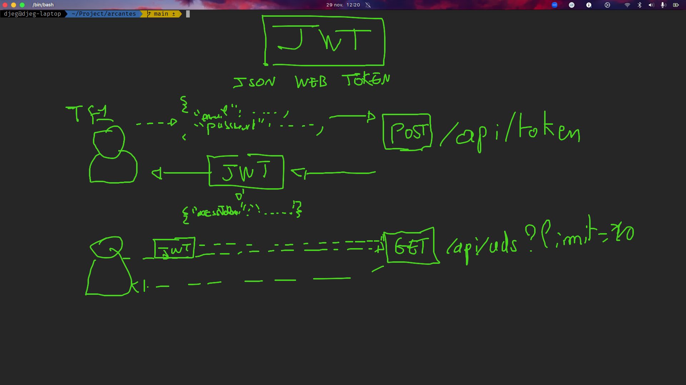

# Les API Rest avec symfony

Avant même de pouvoir créer sa première avec symfony, il nous faut tout d'abord installer le support de `JSON`

> Et oui ... Blague : Symfony est un framework « moderne » qui ne supporte JSON de base ...

```bash
# sans docker
symfony composer require symfony-bundles/json-request-bundle
# avec docker
bin/sf composer require symfony-bundles/json-request-bundle
```

## Créer son premier « endpoint »

Pour créer un « endpoint » (ex: /addresses), il suffit de tout d'abord créer un controller pour notre
api et nos adresses :

```bash
# sans docker
symfony console make:controller ApiAddress
# avec docker
bin/sf console ma:con ApiAddress
```

Nous pouvons ajouter une méthode correspondant au « endpoint » de notre api :

```php
#[Route('/api/addresses', name: 'app_apiAddress_list', methods: ['GET'])]
public function list(AddressRepository $repository): Response
{
  $addresses = $repository->findAll();

  return $this->json($addresses);
}
```

Donc, pout transformer n'importe quelle entité en JSON, il suffit dans un controller de lancer :

```php
return $this->json($entity);
```

Il est possible d'ignore certains champs de nos entité lors de la transformation en JSON. Et oui, un problème peut survenir très vite ... Les adresses sont relié à un utilisateur, mais l'utilisateur et lui aussi relié à des adresses, et ces adresse sont à nouveau relié aux utilisateurs ... Nous rencontrons un problème de récursion (boucle infinie).

Afin d'éviter les boucles infinie, il suffit d'ouvrir l'entité « Address » et d'ignorer la propriété user de notre JSON en utilisant l'attribut PHP `Ignore` :

```php
#[Ignore]
#[ORM\ManyToOne(inversedBy: 'addresses')]
#[ORM\JoinColumn(nullable: false)]
private ?User $user = null;
```

## Les codes de retour (status code)

Les api REST doivent respécter les status code HTTP. Il sont rangé en 5 catégories :

1. Les codes commencant par `1XX` : Se sont des codes d'informations (très peu utilisé)
2. Les codes commencant par `2XX` : Se sont des codes de success (très utilisé)
3. Les codes commencant par `3XX` : Se sont des codes de redirection (très peu utilisé)
4. Les codes commencant par `4XX` : Se sont des codes d'erreur de la part du client (très utilisé)
5. Les codes commencant par `5XX` : Se sont des codes d'erreur du serveur (on ne veut surtout pas les utiliser)

Parmis ces codes voici les plus célébres :

- **`200`** : Signifie « OK » c'est le code utilisé dans 80% des cas lorsque tout c'est bien passé
- **`201`** : Signifie « Created », c'est le code utilisé pour les requêtes POST !
- **`204`** : Signifie « No Content », c'est le code utilisé lorsque l'on fait un GET et qu'il n'y as aucun résultat.
- **`404`** : Signifie « Not Found », c'est le code utilisé lorsque l'url n'est pas bonne
- **`400`** : Signifie « Bad Request », c'est le code utilisé lorsqu'une erreur de formulaire est présente.

Pour utiliser ces codes, il suffit de spécfifier un second argument à la méthod JSON :

```php
$this->json($addresses, 200);
```

## Les formulaires pour les API

Même si une api rest ne possède pas de formulaire HTML, les forms symfony sont toujours aussi utilisé. En effet, c'est eux qui s'occupe de valider, transformer et gérer les données envoyé par un client.

Prenons un exemple : La création d'une adresse

```http
POST http://localhost:12000/api/addresses
Content-Type: application/json

{
  "label": "Chez moi",
  "city": "Toulouse",
  "zipCode": "31000",
  "street": "56 rue des carmes"
}
```

Les formulaires d'api, ne **contienne pas de protection CSRF** et n'ont aucun prefix :

```php
class ApiAddressType extends AbstractType
{
  public function buildForm(FormBuilderInterface $builder, array $options)
  {
    // ! Les formulaires d'api n'ont pas de boutons !
    $builder
      ->add('label')
      // ! les formulaires d'api n'ont pas besoin de label !
      ->add('city')
      ->add('zipCode')
      ->add('street')
  }

  public function configureOptions(OptionsResolver $resolver)
  {
    $resolver->setDefaults([
      'data_class' => Address::class,
      // Il est obligatoire de désactiver la protection CSRF
      'csrf_protection' => false
    ]);
  }

  /**
   * Il faut aussi un prefix vide
   */
  public function getBlockPrefix(): string
  {
    return '';
  }
}
```

Maintenant nous pouvons utiliser ce formulaire dans un controller :

```php
#[Route('/api/addresses', name: 'app_apiAddress_create', methods: ['POST'])]
public function create(AddressRepository $repository, Request $request): Response
{
  // Création du formulaire
  $form = $this->createForm(ApiAddressType::class);

  // On remplie avec les données du client
  $form->handleRequest($request);

  // On test la validité de notre formulaire
  if (!$form->isSubmitted() || !$form->isValid()) {
    // On vas retourner en json les erreur du formulaires
    // ! Il faut respecter les codes de retour : 400 !
    return $this->json($form->getErrors(), 400);
  }

  // on récupére l'address du formulaire
  $address = $form->getData();

  // On enregistre l'address dans la base de données
  $repository->save($address, true);

  // On retourne l'address qui vient d'être créé
  return $this->json($address, 201);
}
```

## L'authentification

Afin de se connécté à une API Rest, nous utilisons un système de [JWT (Json Web Token)](https://jwt.io/). Pour schèmatiser le fonctionnement voici un petit dessin :



### Installer le « bundle » (plugin) nous permettant de gérer le JWT

Symfony à tout prévu, il éxiste un « bundle » (extension symfony) qui s'occupe de tout pour nous ! Voici sa [documentation officiel](https://symfony.com/bundles/LexikJWTAuthenticationBundle/current/index.html)

La première étape est d'installer le bundle :

```bash
# sans docker
symfony composer require lexik/jwt-authentication-bundle
# avec docker
bin/sf composer req lexik/jwt-authentication-bundle
```

### Configurer le « bundle » d'authentification

Nous configurer devons l'extension, pour cela ouvrir le fichier `config/packages/lexik_jwt_athentication.yaml` et placer la configuration suivante :

```yaml
lexik_jwt_authentication:
  secret_key: "%kernel.project_dir%/config/jwt/private.pem"
  public_key: "%kernel.project_dir%/config/jwt/public.pem"
```

Il nous faut ensuite configurer les clé de cryptage avec la commande :

```bash
# sans docker
symfony console lexik:jwt:generate-keypair
# avec docker
bin/sf console lexik:jwt:generate-keypair
```

L'étape suivante et de configurer la sécurité de notre application (Firewall et ACL) pour cela, ouvrir le fichier `config/package/security.yml` et placer les séctions suivante :

```yaml
security:
  # Dans le firewall :
  firewalls:
        # On ajoute un firewall concernant la création du token
        api_login:
            pattern: ^/api/token
            stateless: true
            json_login:
                check_path: /api/token
                success_handler: lexik_jwt_authentication.handler.authentication_success
                failure_handler: lexik_jwt_authentication.handler.authentication_failure

        # On configure le firewall de l'API
        api:
            pattern:   ^/api
            stateless: true
            jwt: ~

    # Dans l'access control, on rend accesible l'url de création de token
    access_control:
        - { path: ^/api/token, roles: PUBLIC_ACCESS }
        # Vous pouvez si vous le désirez, rendre l'intégralité de votre API
        # accessible uniquement aux clients possédant un token
        - { path: ^/api, roles: IS_AUTHENTICATED_FULLY }
```

Et enfin ajouter la route de connexion par token, pour ça rendez-vous dans le fichier `config/routes.yaml` et ajouter à la suite la configuration suivante

```yaml
api_login_check:
  path: /api/token
```

> Vous pouvez personaliser les routes de création de token, ici nous avons spécifié `/api/token` mais cela peut-être ce que vous souhaitez !

Maintenant que la connexion via JWT est configurer nous pouvons obtenir un token :

```http
POST http://localhost:12000/api/token
Content-Type: application/json

{
  "username": "test@mail.com",
  "password": "test"
}
```

Cette requête vas nous retourner un token, grâce à ce token nous pouvons accéder à n'importe quelle endpoint de notre api facilement :

```http
GET http://localhost:12000/api/addresses
Authorization: Bearer <token>
```
