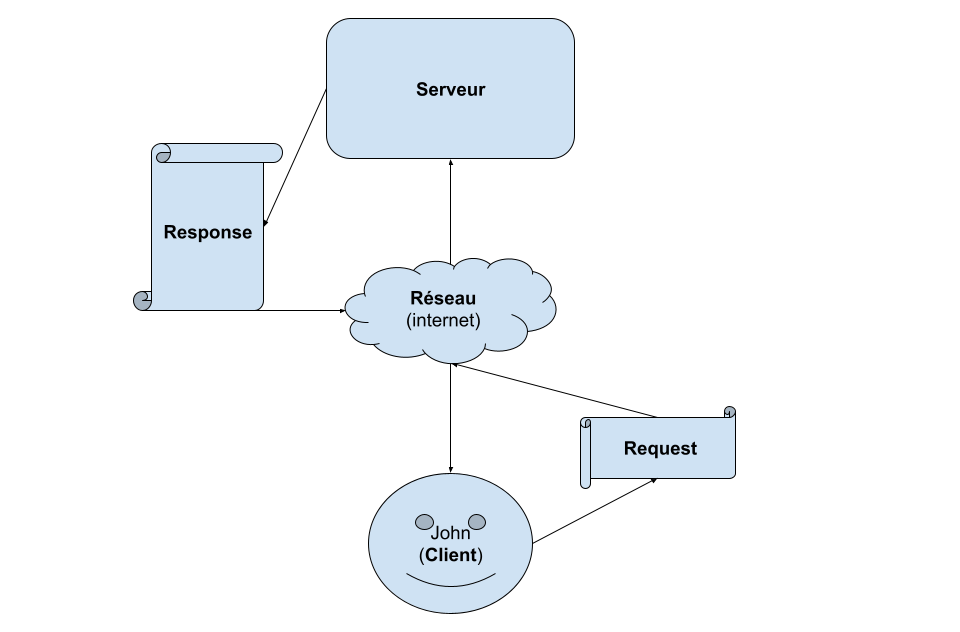
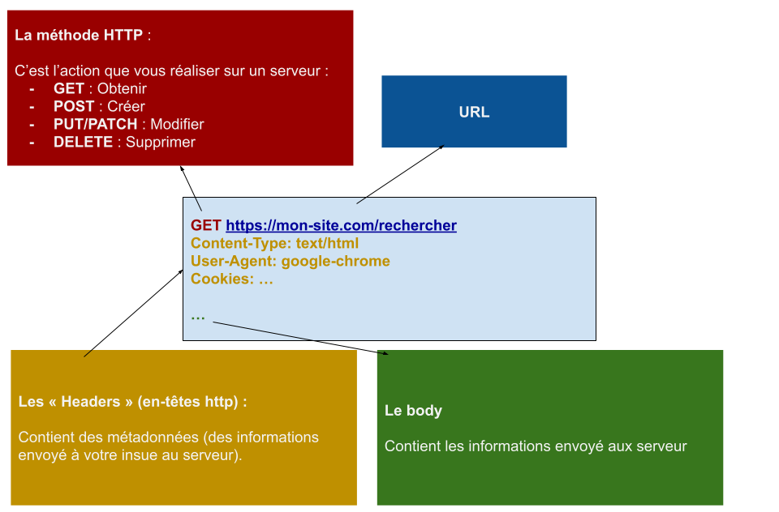
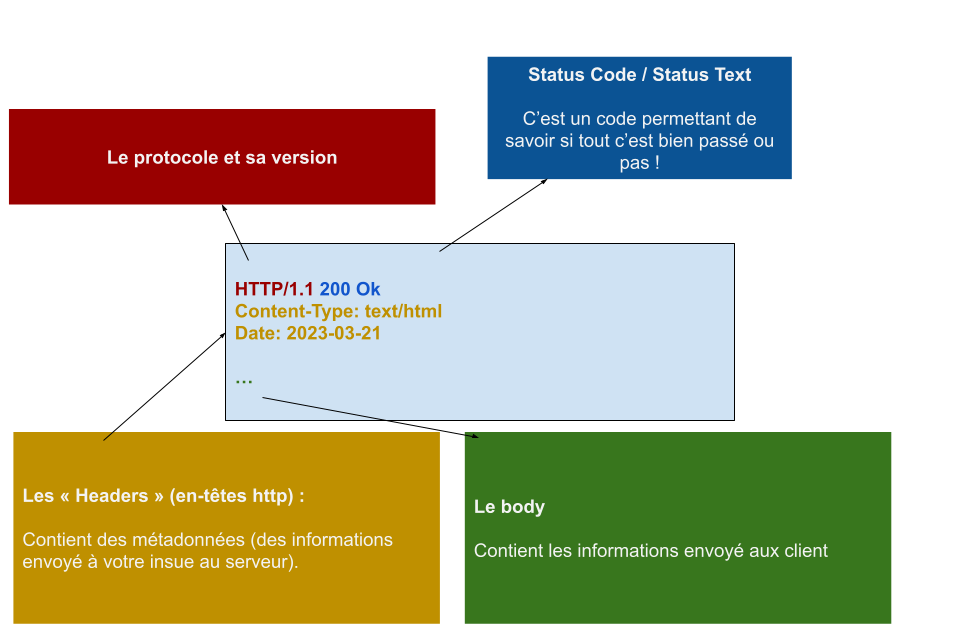
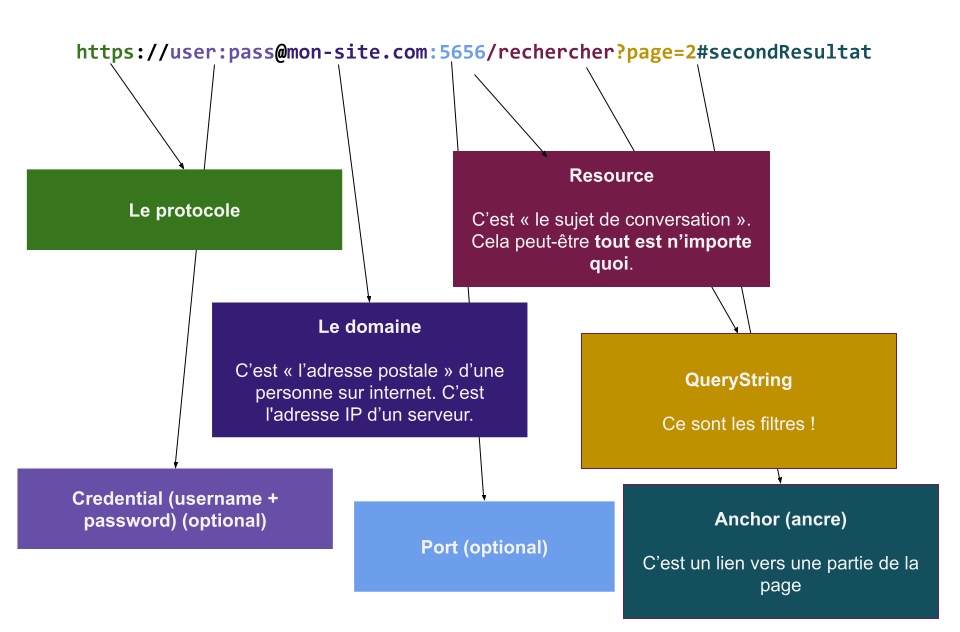
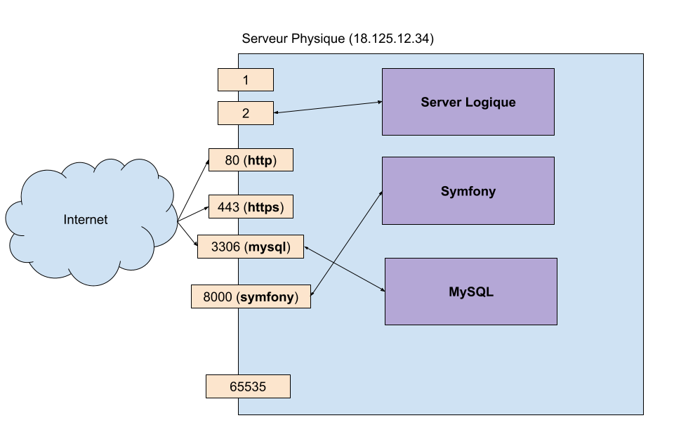

# Découvrir et comprendre le « Web »

## C'est quoi le « web » ?

Le « web » est le terme commun pour « HTTP ».

## C'est quoi HTTP ?

En informatique pour communiquer entre deux ordinateurs on utilise un protocole :

- **FTP** (File Transfert Protocole) : c'est une langue utilisé afin de partager des fichiers
- **HTTP** (HyperText Transfert protocole) : C'est celui qui nous interese. Au départ il permettait d'échanger du texte, aujourd'hui il représente 95% du trafic du trafic mondial sur internet, il permet **de tout échanger** !!!!
- **SMTP / POP3** : C'est la langue utilisé pour échanger des emails !
- **SOCKET/WEBSOCKET** : C'est des protocoles de « temps réel »
- **MYSQL** : C'est la langue utilisé pour communiquer avec une base de données.
- Il en existe des millions d'autres !

Le protocole que nous allons découvrir est HTTP !

## Réseaux, client et serveur !

Afin de communiquer correctement et à plusieurs, les ordinateurs passent par un intermédiaire : `Les reseaux` et les `serveurs` :

## HTTP et les enveloppes

HTTP est un protocole très simple. Le principe est d'échanger, comme un service postale, des enveloppes (des lettres). Le client, envoie une première enveloppe : **La Request** et le serveur écrit une autre enveloppe : **La Response** :

## `La Request`

C'est la première enveloppe préparé par le client, elle contient des informations formatté d'une manière bien précise :

## `La response`

C'est ce que le serveur renvoie au client :

## Les `URL`

La _magie_ qui permet d'établir la communication c'est l'URL (**Unified Resource Location**) :

## Le `Serveur` !

Lorqu'on parle de serveur, on peut parler de 2 choses complétement différente !

### **Le serveur physique**

Un ordinateur connécté à un réseaux 24h/24 (Il ne faut qu'il change d'ip ....) !

### **Le serveur logique**

C'est un programme d'écoute d'entrée et de sortie d'un réseaux :

