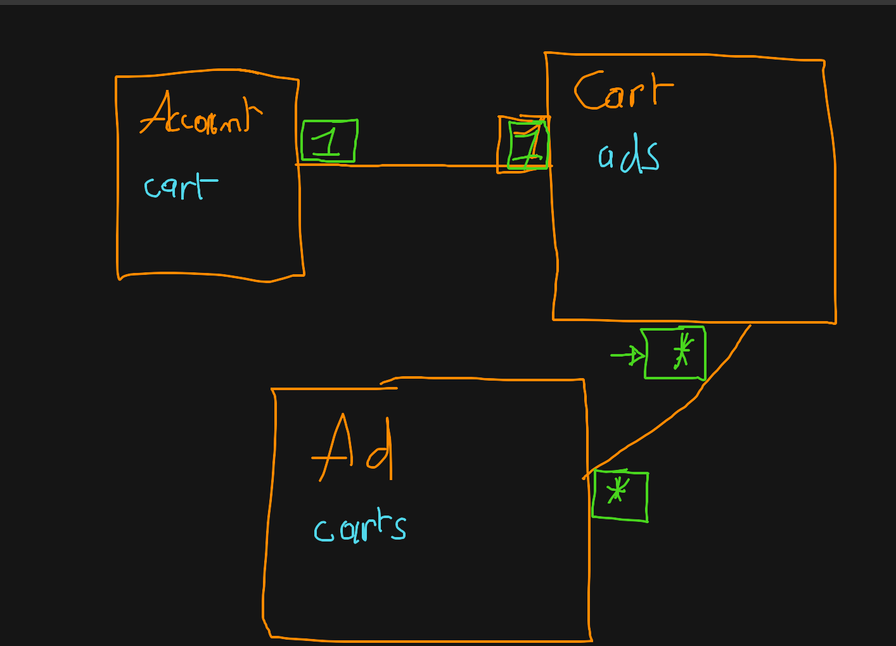
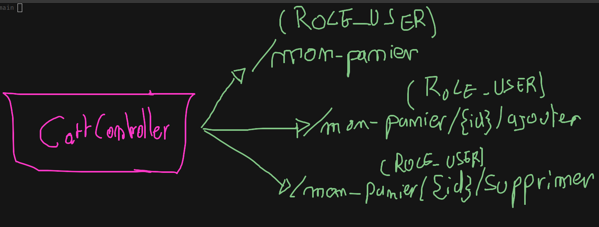

# Le Panier

L'objectif de cet exercice est de développer un système complet de panier :

## 1. Créer et configurer l'entité « Cart »

Générer une entité « Cart » avec les champs suivant :

| nom     | type     |
| ------- | -------- |
| account | relation |
| ads     | relation |

## 2. Attacher un « Cart » lors de la création des « Account »

Dans le constructeur de l'entité « Account », faire en sorte de lui créer un « Cart » ...

## 3. Créer le « CartController »

Générer un controller « CartController »

## 4. La page du panier

Ajouter dans le « CartController » une route : `/mon-panier` (accessible uniquement au ROLE_USER !).

Ce controller doit afficher un vue avec à l'intérieur :

- Les annonces contenue dans le panier (ajouter un bouton supprimer)
- Le prix total
- Un bouton pour valider

## 5. Ajouter au panier

Ajouter dans le « CartController » une route : `/mon-panier/{id}/ajouter` (accessible uniquement au ROLE_USER !).

Ce controller doit ajouter l'annonce avec l'identifiant donnée et rediriger vers la page du panier.

> Faire un lien sur la page d'accueil et recherche lorsque l'on clique sur le bouton « Ajouter »

## 5. Supprimmer du pnier

Ajouter dans le « CartController » une route : `/mon-panier/{id}/supprimer` (accessible uniquement au ROLE_USER !).

Ce controller doit supprimer l'annonce avec l'identifiant donnée et rediriger vers la page du panier.

> Faire un lien sur la page du panier lorsque l'on clique sur le bouton « Supprimer »
