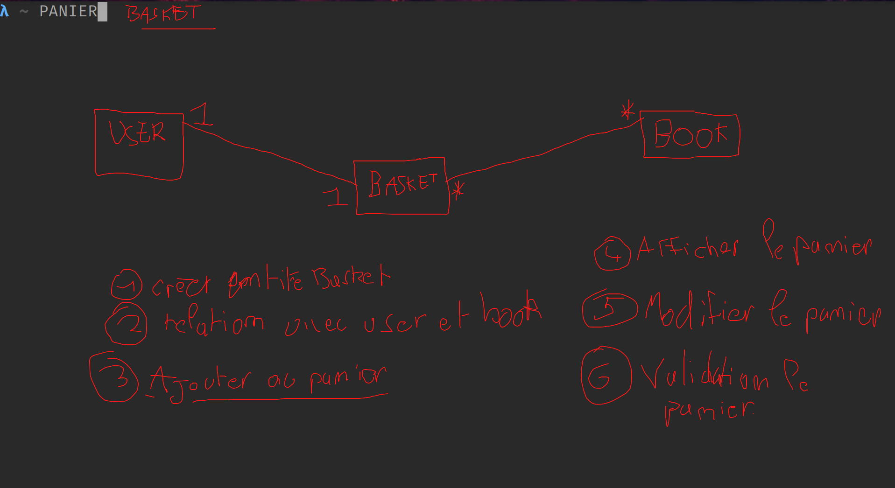

# Création d'un système de panier

## Génération de l'entité « Basket »

Graçe à la commande `symfony console make:entity`, créer une entité
`Basket` avec les champs suivant :

| nom   | type     |
| ----- | -------- |
| user  | relation |
| books | relation |

> N'oubliez pas de mettre à jour votre base avec la commande
> `symfony console d:s:u --force`

Faire en sorte que lorsque l'on créer un User, ce dernier
possède un panier.

> Vous pouvez utiliser le constructeur de la class `User` ...

## Ajouter au panier

Dans premier temps, créer un controller `App\Controller\Front\BasketController`. Ajouter
une méthode `add` avec la route `/mon-panier/{id}/ajouter` (ou l'id est l'id d'un livre).

Récupérer le panier de l'utilisateur connécté.

Ajouter le livre correspondant à l'id dans le panier (eg: `$basket->addBook($book);`).

Enregistrer la panier dans la base de données.

Rediriger vers la page d'affichage du panier créé plus bas.

> Indice, vous pouvez récupérer l'utilisateur connécté avec `$this->getUser()`. Autre
> indice, ajouter au panier n'est possible que si l'on est connécté ...

## Afficher le panier

Dans le controller `App\Controller\Front\BasketController`, ajouter une méthode
`display` avec la route `/mon-panier`.

Récupérer le panier de l'utilisateur connécté.

Afficher une page html (en suivant les conventions de nommage) qui affiche
tout les livres du panier (avec leurs prix) et en plus le prix total du panier.

> Indice, vous pouvez récupérer l'utilisateur connécté avec `$this->getUser()`. Autre
> indice, afficher le panier n'est possible que si l'on est connécté ...
> Enfin, l'entité `Basket` peut possèder des méthodes personalisé ....

Ajouter dans le menu un lien vers `Mon Panier` si l'utilisateur est connécté.

### BONUS

Si le panier est vide afficher un petit message : `Votre panier est vide :)`

## Supprimer du panier

Dans le controller `App\Controller\Front\BasketController`, ajouter une méthode
`remove` avec la route `/mon-panier/{id}/supprimer`.

Récupérer le panier de l'utilisateur connécté et supprimer le livre (eg: `$basket->removeBook($book)`).

Enregistré le panier dans la base de données.

Rediriger vers la page d'affichage du panier.

Ajouter un lien dans l'affichage du panier sur chaque livres afin de le supprimer du panier.

## Validation du panier

Dans le controller `App\Controller\Front\BasketController`, ajouter une méthode
`validate` avec la route `/mon-panier/validation`.

Récupérer le panier de l'utilisateur connécté.

Afficher une page HTML avec le récapitulatif du panier (les livres, leurs prix et le prix total)
ainsi qu'un formulaire de carte bleu... (numéro, nom, date d'expiration, CVC).

Lorsque le formulaire est soumis et valide, créer une commande attaché à l'utilisateur et
aux livre du panier, ainsi que modifier les livres en rajoutant une option "sold" à true !

Rediriger vers la page de confirmation de commande : `/commandes/{id}/confirmation`
