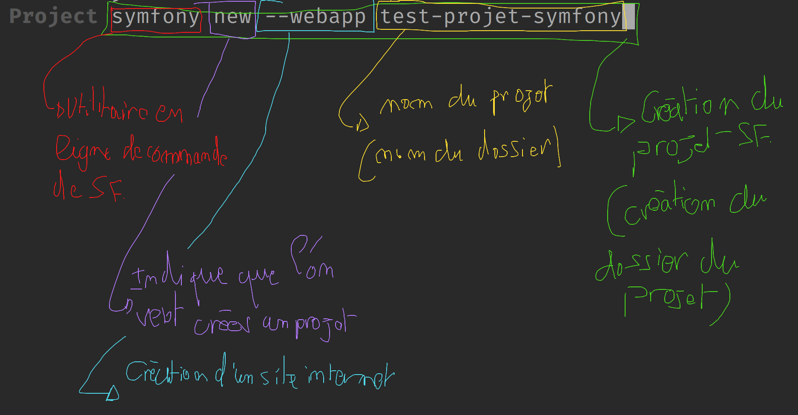
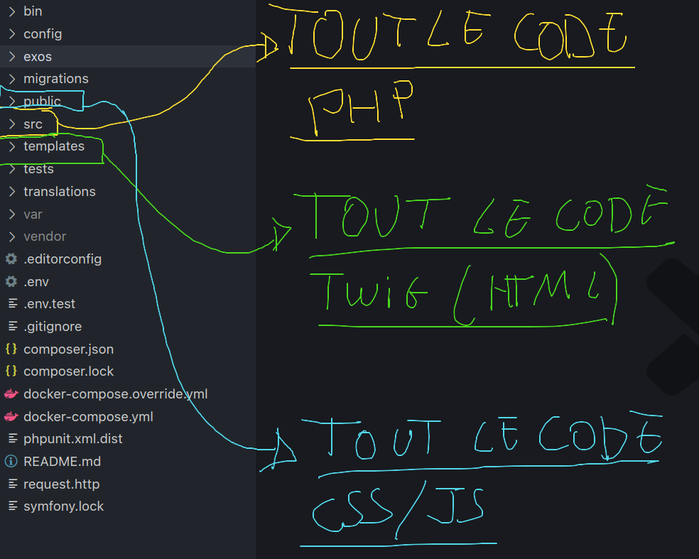

## Correction Interactive Calculatrice

Dans se fichier vous retrouverez toutes les étapes de la correction
interactive de la calculatrice.

## 1. Mise en place

1. Choisir un dossier et de s'y rendre avec un terminal récent (powershell, git bash etc ...).

> Astuce : Vous pouvez utiliser les commande `ls`, `pwd` et `cd` afin de naviguer
> dans votre ordinateur via votre terminal.

2. Lancer la commande `symfony new --webapp nom-du-projet` afin de créer un nouveau
   projet symfony :

3. Ouvrir VSCode dans le projet tout juste créé

> Astuce : Vous pouvez utiliser `cd` pour déplacer dans le projet tout juste
> créé et lancer la commande `code .`.

## 2. Organisation

Un projet contient 3 dossiers à connaître par coeur :

