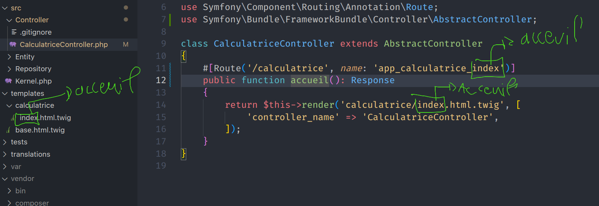

## Correction Interactive Calculatrice

Dans se fichier vous retrouverez toutes les étapes de la correction
interactive de la calculatrice.

## 1. Mise en place

1. Choisir un dossier et de s'y rendre avec un terminal récent (powershell, git bash etc ...).

> Astuce : Vous pouvez utiliser les commande `ls`, `pwd` et `cd` afin de naviguer
> dans votre ordinateur via votre terminal.

2. Lancer la commande `symfony new --webapp nom-du-projet` afin de créer un nouveau
   projet symfony :


3. Ouvrir VSCode dans le projet tout juste créé

> Astuce : Vous pouvez utiliser `cd` pour déplacer dans le projet tout juste
> créé et lancer la commande `code .`.

## 2. Organisation

Un projet contient 3 dossiers à connaître par coeur :


## 3. Controller le serveur

Pour afficher le site internet symfony que nous venons de créer,
il faut démarrer le server symfony. Pour cela vous pouvez
utiliser le terminal de VSCode et lancer la commande suivante :

```
symfony server:start
```

> Astuce 1 : Pour arréter le serveur, utiliser la combinaison de
> touche : <Ctrl-C>

> Astuce 2 : Vous pouvez aussi arréter le serveur depuis un autre terminal
> en utilisant la commande `symfony server:stop`

> Astuce 3 : VOUS NE POUVEZ PAS LANCER DE COMMANDE À L'INTÉRIEUR
> DU SERVEUR SYMFONY

Une fois cette commande lancé, symfony démarre un serveur logique HTTP sur
votre machine (`127.0.0.1`) sur un port disponible (par défaut le port `8000`).
Ainsi pour accéder au site internet symfony il suffit de rentrer l'addresse suivante :

```
http://127.0.0.1:8000
```

> ATTENTION : Le port peut varier, ce n'est pas forcèment le port 8000

## 4. Création d'un controller

Symfony utilise des controller afin de représenter les pages de notre site
internet. Un controller est une classe, chaque méthodes de cette class
réprésente une page.

Pour créer ce controller il faut utiliser la console symfony.

> Astuce : Vous pouvez lister toutes les commandes de la console symfony
> avec leurs notice d'utilisation en tapant `symfony console`

Nous allons créer un controller pour notre calculatrice : `CalculatriceController`,
afin de créer ce controller, il faut utiliser la commande `symfony console make:controller`

> Astuce : Vous n'êtes pas obligé de taper `make:controller` en entier, les 2 premières
> lettres de chaque mot suffisent : `symfony console ma:co`


## Le controller :

### La namespace


### Les uses


### La route


### Les conventions de nommage




## La vue :

### 1. Utiliser la méthode "render" du controller


### 2. Utiliser twig


### 3. Supprimer « encore »


## La page d'accueil de la calculatrice

1. [Supprimer les variables dans le CalculatriceController](https://github.com/Djeg/formation-symfony/commit/8ef315db300498fc5f636c654fed4b67c2b5f09b)
2. [Création de la page d'accueil de la calculatrice](https://github.com/Djeg/formation-symfony/commit/a89f491233bfde80b83a45f23247e6a7902812a0)

## La page additionner :

### 1. Les paramètres de routes


### 2. Ajout du code de la page additionner :

Vous retrouverez le code [ici](https://github.com/Djeg/formation-symfony/commit/445e8256ae8bceabe8c8cef3d1a9cd54f30e2cdcc)
